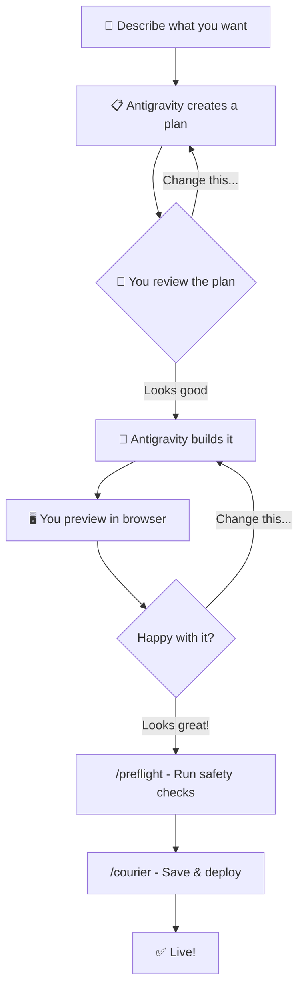
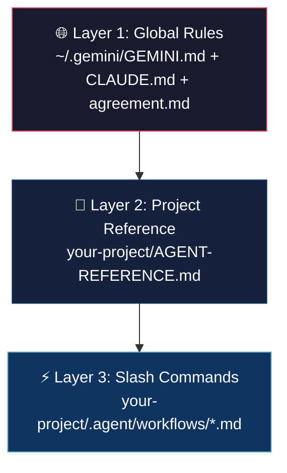

# 🚀 Getting Started with Antigravity AI

> **A Complete Guide for Anyone — No Coding Experience Required**

---

## What Is Antigravity?

Think of Antigravity as having a **full engineering team sitting next to you**, ready to work whenever you are — day or night. You talk to it in plain English, and it builds real software for you.

Here's what it can do:

- **Build complete applications** — websites, dashboards, APIs, databases — from a conversation
- **Read and understand code** — it navigates your entire project like a senior developer would
- **Run things on your computer** — installs tools, starts servers, runs tests
- **Browse the web** — looks up documentation, APIs, and best practices
- **Remember what it learns** — it gets smarter about your projects over time by remembering patterns, your preferences, and past decisions
- **Call in specialists** — 25 built-in "expert agents" that each focus on one job (security, performance, testing, design, etc.)

> [!IMPORTANT]
> You do **not** need to know how to code. You describe what you want in everyday language and Antigravity builds it. Think of yourself as the boss, and Antigravity as your engineering team.

---

## 🧠 The Mental Model — How to Think About This

The easiest way to understand Antigravity is to imagine you just hired a team of expert engineers. Each person has a specialty:

| Your Role | Antigravity Equivalent | What They Do |
|---|---|---|
| **You** (the boss) | You — describing what you want | Give directions in plain language |
| **Software Architect** | `/architect` | Designs the big picture |
| **Frontend Developer** | Antigravity | Builds what users see (screens, buttons, pages) |
| **Backend Developer** | Antigravity | Builds what happens behind the scenes (data, logic) |
| **QA Tester** | `/stage` | Opens a browser and clicks every button to find bugs |
| **Security Engineer** | `/sentinel` | Finds and fixes security holes |
| **UX Designer** | `/palette` | Makes the interface easier and prettier to use |
| **Code Reviewer** | `/critic` | Reviews every file for quality |
| **DevOps Engineer** | `/courier` | Safely ships your code to production |
| **Performance Engineer** | `/bolt` | Makes everything faster |
| **Dependency Manager** | `/medic` | Keeps your software's building blocks healthy |

The key idea: **You don't need to be any of these people.** You just need to tell them what you want.

---

## 🏁 Your First Session — Step by Step

Let's walk through exactly what happens when you use Antigravity for the first time.

### Step 1: Open Antigravity

Launch the application on your Mac. You'll see a chat window — this is your communication channel with the AI. It looks like a messaging app because that's essentially what it is: you send messages, and the AI responds.

### Step 2: Describe What You Want

Write a clear description of what you want to build. **The more detail you give, the better the result.** You don't need to use technical terms — just describe it like you would to a person.

````carousel
**❌ Too vague — avoid this:**
> "Build me a website"

This gives Antigravity no direction. What kind of website? What does it show? Who uses it? You'll get something generic and probably not what you wanted.
<!-- slide -->
**✅ Good — try this instead:**
> "I need a dashboard for managing customer contacts. It should have:
> - A login page
> - A main dashboard showing recent contacts
> - A page to add new contacts (name, email, phone)
> - A settings page
> Use a dark theme with modern design. Deploy it on AWS."

This tells Antigravity exactly what to build, how it should look, and where it goes. Much better results.
````

### Step 3: Let It Plan First — Don't Skip This!

Before writing a single line of code, Antigravity will present a **plan**. This is one of the most important moments in the process. The plan shows you:

- **What files it will create or change** — so you know the scope
- **What technologies it will use** — so you can ask questions if something sounds wrong
- **What the approach looks like** — the overall strategy

> [!TIP]
> **Always, always review the plan.** Say "proceed" only when you understand and agree with the approach. If something doesn't look right, just say so: *"I'd rather do it this way..."* or *"Can you explain why you chose that?"* — Antigravity will adapt. There's no penalty for asking questions. This is YOUR project.

### Step 4: Watch It Build

Once you approve, Antigravity works through the plan:

1. Creates project files and folders
2. Writes all the code
3. Installs any tools or libraries needed
4. Starts a local server so you can see it working immediately

You'll see progress updates as it works. This part usually takes a few minutes depending on the size of the project.

### Step 5: Review and Iterate

Open your browser to see the result. Then tell Antigravity what to change — in plain language:

- *"The button color should be blue, not green"*
- *"Add a search bar at the top of the contacts page"*
- *"The login page needs a 'forgot password' link"*
- *"That table is hard to read — can you add alternating row colors?"*

**Repeat this cycle until you're happy.** Good software is built through iteration — no one gets it perfect on the first try, and that's completely normal.

---

## 🛠️ Meet Your AI Team — The 25 Slash Commands

Slash commands are your **power tools**. Each one activates a specialized agent — an expert at a very specific job. You type them directly in the chat window, like `/preflight` or `/sentinel`.

Think of them like calling different departments in a company: you don't need to know how they do their job, you just need to know *which department to call* and *when to call them*.

---

### 🟢 Daily Use — The Three You'll Use Most

These are your everyday tools. You'll use them in almost every session.

---

#### `/launch` 🚀 — Start Your Workspace

**What it does:** Gets your local development environment running. It checks that everything is set up correctly and starts your server so you can see your project in the browser.

**When to use it:** At the **beginning of every work session**. It's like turning on the lights when you walk into the office.

**Example:**
> You sit down to work on your project. Type `/launch`. Antigravity checks your environment, starts the server, and tells you where to open your browser (usually http://localhost:3000). You're ready to work.

---

#### `/preflight` ✈️ — Safety Check Before Saving

**What it does:** Runs a series of automated checks on your code to catch problems before they go anywhere. It checks:
- Does the code compile without errors?
- Are all the dependencies in sync?
- Do the tests pass?
- Does the linter (style checker) approve?
- Were any critical files changed that need special review?

**When to use it:** Before you save and deploy your changes. Think of it like a pilot's checklist before takeoff — you don't skip it.

**Example:**
> You've been making changes for an hour. Before deploying, type `/preflight`. It finds that one of your changes broke a test. You fix it before it becomes a problem in production.

---

#### `/courier` 📦 — Save and Deploy

**What it does:** The full deployment workflow: runs `/preflight` first (stops if anything fails), then saves your changes to version control (Git), and pushes them to your hosting platform so they go live.

**When to use it:** When you're **done with a set of changes** and ready to deploy them.

**Example:**
> You finished adding a new feature. Type `/courier`. It runs preflight checks, creates a proper commit message, and pushes to production. If your cloud build succeeds, your changes are live.

---

### 🔵 Quality & Review — Making Sure Your Code Is Solid

Use these when you want to check the overall health and quality of your project.

---

#### `/architect` 🏗️ — Full Architecture Review

**What it does:** Performs a deep, comprehensive review of your entire project — like hiring a consulting firm to audit your building's blueprints. It scores your project across six dimensions (architecture, code quality, security, reliability, maintainability, testing) and produces a prioritized list of improvements.

**When to use it:** When **starting a new project** (to set a baseline), after **completing a major phase**, or when you just want to know "how good is my project overall?"

**Example:**
> You've been building for a few weeks. Type `/architect`. It comes back with an 7/10 score, flags that your error handling is inconsistent, and gives you a prioritized fix list. Now you know exactly what to improve.

---

#### `/critic` 📝 — Code Quality Review

**What it does:** Reads through your entire codebase looking for quality issues: leftover `console.log` statements, TODO comments, weak typing, files that are too long and should be split up, and general code cleanliness.

**When to use it:** After **completing a major feature** or during a cleanup session.

**Example:**
> You just finished building the reports page. Type `/critic`. It finds 5 files with console.log statements that shouldn't be in production, 2 files over 500 lines that should be split, and 8 places with weak typing. You fix them before anyone else sees the code.

---

#### `/stage` 🎭 — End-to-End Browser Testing

**What it does:** Opens a **real browser**, logs into your application, and systematically clicks every button, tab, link, and dropdown on every page. It records all errors, takes screenshots of broken states, and gives you a detailed report.

**When to use it:** After **any UI changes**, and definitely before deploying.

**Example:**
> You redesigned the dashboard. Type `/stage`. It visits every page, clicks every element, and reports that the "Delete" button on the settings page throws an error. You catch the bug before your users do.

---

#### `/tester` 🧪 — Test Health Audit

**What it does:** Looks at your automated tests and assesses their quality. Finds coverage gaps (important code paths with no tests), flaky tests (tests that sometimes pass and sometimes fail), stale mocks (test fakes that no longer match the real code), and missing edge cases.

**When to use it:** When you want to know if your tests are **actually protecting you** or just giving you a false sense of security.

**Example:**
> Type `/tester`. It reports that your authentication logic has 45% test coverage (should be 80%+), and two tests are flaky because they depend on timing. Now you know what tests to add.

---

### 🟡 Maintenance & Optimization — Keeping Things Healthy

These agents focus on keeping your project clean, fast, and up-to-date.

---

#### `/sentinel` 🔒 — Security Scanner

**What it does:** Scans your entire project for security vulnerabilities: checks for hardcoded passwords or API keys, audits your dependencies for known security issues, verifies your authentication setup, and looks for sensitive data that might be getting logged.

**When to use it:** **Before every deployment**, and regularly as a health check (monthly at minimum).

**Example:**
> Type `/sentinel`. It finds that one of your dependencies has a known vulnerability (CVE-2025-1234), and someone left a test API key in the code. It fixes both before an attacker could exploit them.

---

#### `/bolt` ⚡ — Performance Optimizer

**What it does:** Hunts for things that make your application slow: inefficient database queries, unnecessary screen re-renders, missing caching, code that forces the browser to do unnecessary work. Then it implements targeted fixes.

**When to use it:** When your app **feels sluggish**, or when `/architect` flagged performance issues.

**Example:**
> Your dashboard takes 4 seconds to load. Type `/bolt`. It finds that you're making 15 separate database calls that could be combined into 2, and a list of 500 items that should be using virtual scrolling. After fixes, load time drops to 1 second.

---

#### `/medic` 💊 — Dependency Health Check

**What it does:** Checks all the software packages your project depends on: flags outdated versions, notes known security vulnerabilities, identifies packages you installed but never actually use, and flags license issues.

**When to use it:** Monthly, or before deployments.

**Example:**
> Type `/medic`. It reports 3 packages are outdated (one with a security fix), and 2 packages are installed but never used (wasting space). It updates the safe ones and removes the unused ones.

---

#### `/janitor` 🧹 — Dead Code Cleaner

**What it does:** Finds and removes code that's no longer used: unused functions, commented-out code blocks, files that nothing imports, stale feature flags. Every line of code is a potential source of bugs — code that does nothing is pure liability.

**When to use it:** During **cleanup sessions**, or when your project starts feeling bloated.

**Example:**
> Type `/janitor`. It finds 12 unused functions, 3 files that nothing imports, and 200 lines of commented-out code. It safely removes them, making the codebase cleaner and easier to understand.

---

#### `/hunter` 🎯 — Technical Debt Tracker

**What it does:** Finds and catalogs "technical debt" — shortcuts and quick fixes that need to be properly addressed eventually. Scans for TODO/FIXME comments, `any` type usage (weak typing), eslint-disable overrides, and other markers of deferred work.

**When to use it:** When **planning maintenance work** — to see exactly what needs attention and how to prioritize it.

**Example:**
> Type `/hunter`. It produces an inventory: 15 TODO comments (5 are high-priority), 8 places using `any` type (each one is a bug waiting to happen), and 3 eslint-disable comments. Now you can plan your cleanup sprint.

---

#### `/packer` 📦 — Bundle Size Optimizer

**What it does:** Analyzes the size of your frontend application and implements techniques to make it smaller and faster to load: code splitting (loading only what's needed), lazy loading, and identifying heavy dependencies that could be replaced with lighter alternatives.

**When to use it:** When your app **takes too long to load initially**, especially on mobile.

**Example:**
> Type `/packer`. It finds your frontend bundle is 1.2MB. After splitting routes and lazy-loading admin pages, it drops to 400KB. Your users on slower connections will thank you.

---

#### `/palette` 🎨 — UX & Accessibility Polish

**What it does:** Finds small UX improvements that make your interface more intuitive and accessible: missing accessibility labels on buttons (so screen readers can describe them), missing loading indicators, poor color contrast, missing keyboard navigation support, and other polish items.

**When to use it:** After building UI, as a **finishing polish** step.

**Example:**
> Type `/palette`. It finds 6 icon-only buttons with no accessibility labels (screen readers would say "button" but not what the button does), and adds proper labels. It also adds a loading spinner to a submit button so users know something is happening.

---

#### `/branchsync` 🔀 — Branch Manager

**What it does:** If you or collaborators have been working on separate branches (parallel copies of your code), this agent discovers all unmerged branches, shows you what changed in each one, tests for conflicts, runs quality checks, and safely merges them back together.

**When to use it:** When you have **branches that need to be merged** back into the main codebase.

**Example:**
> Type `/branchsync`. It shows you 3 unmerged branches. You review each one, approve the merges, and it safely combines them after running all quality checks.

---

### 🟣 Documentation & Governance — Keeping Everything Written Down

These agents make sure your documentation stays accurate and your code stays consistent.

---

#### `/auditor` 📋 — Documentation Review

**What it does:** Performs a systematic review of all your project's documentation. Scores it against enterprise standards, finds mismatches between what the docs say and what the code does, identifies missing sections, and produces a prioritized improvement plan.

**When to use it:** **Before major releases** or during quarterly reviews.

**Example:**
> Type `/auditor`. It discovers your API documentation is missing 7 endpoints that exist in the code, and your architecture diagram is outdated. It produces a plan to fix everything.

---

#### `/scribe` ✍️ — Documentation Enhancer

**What it does:** Goes beyond just checking if docs exist — it actually **improves their quality**. Adds missing examples, fills in gaps, updates stale sections, and ensures docs serve different audiences (developers, operations team, managers).

**When to use it:** When your docs need to go from **"exists"** to **"actually useful."**

**Example:**
> Type `/scribe`. It finds your README is missing a quickstart guide, your API docs have no examples, and there's no troubleshooting section. It writes all of them.

---

#### `/mirror` 🔗 — Schema Consistency Checker

**What it does:** In many projects, the same data structure is defined in multiple places — database schemas, validation rules, API documentation, TypeScript types. Mirror checks that all of these **stay in sync** with each other. When they drift apart, bugs happen.

**When to use it:** After **database or API changes**.

**Example:**
> You added a new "role" field to your user model. Type `/mirror`. It finds that the database type has the field, but the validation schema and API docs don't. It fixes the drift before it causes runtime errors.

---

#### `/keeper` 📜 — API Contract Validator

**What it does:** Ensures that your API (the interface other software uses to talk to your application) matches its documentation. Finds undocumented endpoints, response shapes that don't match the spec, and breaking changes that could affect anyone using your API.

**When to use it:** After **API changes** — especially before deploying.

**Example:**
> Type `/keeper`. It discovers 3 endpoints that exist in code but aren't documented, and one endpoint where the response format changed in a way that would break existing users. You document the missing endpoints and properly version the breaking change.

---

#### `/sheriff` 🤠 — Code Consistency Enforcer

**What it does:** Checks that your code follows consistent naming conventions, file structures, and patterns throughout the entire project. Inconsistency makes code harder to read and maintain — Sheriff finds where patterns drift and brings them back in line.

**When to use it:** During **code standardization** efforts, or when onboarding new team members.

**Example:**
> Type `/sheriff`. It finds 3 service files that don't follow the naming convention (should end in `Service.ts`), and 5 places where error handling uses a different pattern than the rest of the codebase. It standardizes everything.

---

#### `/sync` 🔄 — Documentation Folder Sync

**What it does:** If your project has a separate documentation folder that needs to stay aligned with your source code docs (common in enterprise projects), this agent tracks changes since its last run and propagates updates to keep everything in sync.

**When to use it:** After **documentation updates** in your source code, to keep external doc folders current.

**Example:**
> You updated your architecture docs. Type `/sync`. It identifies the changes and updates the corresponding sections in your external documentation folder, maintaining consistency.

---

### 🔴 Specialized & Advanced

These agents handle specific scenarios that come up less frequently but are valuable when you need them.

---

#### `/differ` 🔍 — Change Impact Analyzer

**What it does:** Before you make a change to a file, Differ analyzes what else in the project depends on that file, what tests cover it, and what could break. It produces a risk assessment so you can make informed decisions.

**When to use it:** **Before making risky changes** to important files.

**Example:**
> You're about to modify the authentication module. Type `/differ auth.ts`. It shows you that 15 other files import this module, 3 tests cover it, and it's a protected file. Risk level: HIGH. Now you proceed with appropriate caution.

---

#### `/guardian` 🛡️ — Critical File Guardian

**What it does:** Some files are so important that changing them incorrectly could break everything — authentication, database key patterns, security rules. Guardian monitors these files and requires explicit approval before any changes, with an impact analysis.

**When to use it:** It works **automatically** in the background. When you or Antigravity try to modify a protected file, Guardian intervenes and asks for confirmation.

**Example:**
> Antigravity proposes changing your database key file. Guardian flags it: "⚠️ Protected file. This file defines key patterns used by 12 repositories. Changes could break data access for the entire application." You review carefully before approving.

---

#### `/observer` 👁️ — Logging & Monitoring Auditor

**What it does:** Makes sure your application is properly set up for diagnosing problems in production: checks for proper error logging, empty error-catching blocks (where errors get silently swallowed), missing correlation IDs (which help trace a problem through the system), and sensitive data that might accidentally appear in logs.

**When to use it:** When preparing for **production readiness**.

**Example:**
> Type `/observer`. It finds 8 places where errors are caught but silently ignored (meaning bugs could happen and nobody would know), and 3 places where user tokens might accidentally appear in logs. It fixes both.

---

#### `/translator` 🌐 — Translation Completeness Checker

**What it does:** If your application supports multiple languages, Translator checks that every piece of user-facing text has been translated into all supported languages. Finds hardcoded English strings, missing translation keys, and unused translations.

**When to use it:** After adding **new UI text** to a multi-language app.

**Example:**
> You added 5 new buttons with labels. Type `/translator`. It finds that the Spanish and Portuguese translations are missing for all 5. You add them before your non-English users see untranslated text.

---

## 💬 How to Talk to Antigravity — Communication Tips

### Be Specific, Not Technical

You don't need to use programming terms. Just describe what you want in everyday language:

| Instead of... | Say... |
|---|---|
| *"Create a REST API with CRUD endpoints"* | *"I need a backend that lets me create, read, update, and delete customers"* |
| *"Add a React component with state management"* | *"Add a counter on the dashboard that shows how many orders came in today"* |
| *"Implement OAuth2 authentication"* | *"Users should log in with their Google account"* |
| *"Set up CI/CD pipeline"* | *"Every time I push code, I want it to automatically deploy"* |

### The Golden Rule: Describe the "What" and "Why"

Antigravity figures out the "How." Your job is to describe:

1. **What** you're building — *"A page that shows all pending invoices"*
2. **Why** it matters — *"So the finance team can track unpaid invoices"*
3. **For whom** — *"Internal employees only, needs login"*
4. **How it should look** — *"Clean, modern, dark theme, with a table and filters"*

### Don't Be Afraid to Push Back

If Antigravity proposes something you don't like or don't understand, say so:

- *"Explain why you chose that approach"*
- *"I'd prefer a simpler solution"*
- *"That seems over-complicated — is there a simpler way?"*
- *"I don't understand that — can you explain it like I'm 5?"*

The AI adapts to your feedback. There's no wrong question.

---

## 📁 What Antigravity Creates on Your Computer

Antigravity organizes its own files in `~/.gemini/antigravity/`:

```
~/.gemini/antigravity/
├── conversations/     ← 💬 History of all your sessions
├── knowledge/         ← 🧠 Learned patterns from your projects  
├── global_workflows/  ← ⚙️ The slash command definitions
├── brain/             ← 📋 Plans, tasks, and walkthroughs per session
├── scratch/           ← 📂 Default location for new projects
└── browser_recordings/← 🎥 Recordings of browser testing sessions
```

Your actual project code lives wherever you choose, typically in a dedicated project folder.

---

## 🔄 A Typical Workflow — Real World Example

Here's what a real development session looks like:



### Example Session Transcript

> **You:** *"I want a dashboard that shows my team's sales performance. It should have a chart showing monthly revenue, a table of top performers, and a sidebar with filters for date range and region."*
>
> **Antigravity:** *Creates implementation plan, shows files to create, asks for approval*
>
> **You:** *"Proceed"*
>
> **Antigravity:** *Builds the frontend, creates the API, sets up the database, starts the dev server*
>
> **You:** *"The chart should be a bar chart, not a line chart. And add a dark mode toggle."*
>
> **Antigravity:** *Makes the changes, refreshes preview*
>
> **You:** *"/preflight"*
>
> **Antigravity:** *Runs all safety checks — types, builds, tests, security*
>
> **You:** *"/courier"*
>
> **Antigravity:** *Commits, pushes, deploys — done!*

---

## 🧠 The Knowledge System — How It Remembers

One of Antigravity's most powerful features is its **persistent memory**. After working with you, it creates **Knowledge Items (KIs)** — organized notes about your projects, patterns, and decisions.

**What this means for you:**
- It won't keep asking you the same questions
- It remembers your project's architecture and coding patterns
- It applies lessons from past bugs to prevent new ones
- New conversations automatically have context from previous work

> [!NOTE]
> You don't need to manage the knowledge system — it's automatic. But knowing it exists helps you understand why Antigravity gets "smarter" the more you use it.

---

## 📐 User Rules — Customizing How Antigravity Works

You can set rules that Antigravity **always** follows. These are stored in your global settings. For example, the included rules enforce:

- **Always research before coding** — prevents building the wrong thing
- **Show a pre-implementation checklist** — so you review the plan before any code changes
- **Get approval for risky changes** — changes to more than 3 files require your OK
- **Security first** — prioritizes security over speed or convenience

> [!TIP]
> Think of user rules as your "standing orders" to the AI team. You set them once, and every conversation respects them automatically. The starter kit comes with production-grade rules ready to use.

---

## ⚡ Quick Reference — Common Scenarios

| I want to... | What to do |
|---|---|
| Start a brand new project | Describe it in chat and Antigravity creates everything |
| Fix a bug | Describe the symptom — *"When I click Submit, nothing happens"* |
| Add a feature | Describe what it should do — *"Add an export to CSV button on the reports page"* |
| Make it look better | Say *"Make the dashboard look more premium and modern"* or use `/palette` |
| Check for security issues | Type `/sentinel` |
| Deploy my changes | Type `/courier` |
| Review my whole project | Type `/architect` |
| Test everything in the browser | Type `/stage` |
| Start my dev servers | Type `/launch` |
| Clean up messy code | Type `/janitor` then `/critic` |
| Check if my tests are good | Type `/tester` |
| Update outdated packages | Type `/medic` |
| Speed up my app | Type `/bolt` |
| Find all the TODOs | Type `/hunter` |
| Check my documentation | Type `/auditor` |

---

## 🎓 Key Principles for Success

1. **Describe outcomes, not implementation** — Say what you want to achieve, not how to code it
2. **Review plans before approving** — Always look at the plan before saying "proceed"
3. **Iterate in small steps** — Make one change at a time, review, then continue
4. **Use slash commands regularly** — `/preflight` before every deployment, `/sentinel` for security
5. **Trust the memory** — Antigravity gets better the more you use it because it learns your preferences
6. **Be honest about what you don't know** — Ask questions freely. There are no dumb questions.
7. **Don't be afraid to say "no"** — If a plan doesn't look right, push back. The AI adapts.

---

## 🚫 Common Mistakes to Avoid

| Mistake | Why It's Bad | What to Do Instead |
|---|---|---|
| Being too vague | Gets generic, unhelpful results | Be specific about what you want, who it's for, and how it should look |
| Approving plans without reading them | May build the wrong thing entirely | Take 30 seconds to scan the plan before saying "proceed" |
| Making too many changes at once | Hard to figure out what broke if something goes wrong | One feature at a time |
| Skipping `/preflight` | Broken code gets deployed to production | Always run before `/courier` |
| Not describing the audience | Design won't fit the actual users | Say who will use it — "for our internal team" vs "for public customers" |

---

## 🗺️ What's Next?

After reading this guide, try this:

1. **Open Antigravity** and start a new conversation
2. **Describe a simple project** — something like a personal todo list or contact manager
3. **Review the plan** carefully and approve it
4. **Watch it build** and preview the result in your browser
5. **Make 2-3 changes** to practice the back-and-forth iteration loop
6. **Run `/preflight`** to see the safety check system in action
7. **Celebrate** — you just built real software without writing a single line of code! 🎉

---

> *This guide was created by analyzing 100+ real development sessions, 20 knowledge repositories, and 25 specialized agent workflows used in production enterprise projects — all built by a non-programmer using Antigravity AI.*

---
---

# 📦 Starter Kit — Configuration Files Reference

Everything below this line documents **every configuration file** you need to set up Antigravity for a new project. All template files are included in this package inside the `starter-kit/` folder, ready to copy into your project.

---

## 📂 Package Contents

```
coach_gravity/
├── getting-started-antigravity.md    ← This guide (you're reading it)
└── starter-kit/
    ├── README.md                     ← Quick-start instructions
    ├── global/                       ← Goes in ~/.gemini/ (one-time setup)
    │   ├── GEMINI.md                 ← Global rules for Gemini-based AI agents
    │   ├── CLAUDE.md                 ← Global rules for Claude-based AI agents
    │   └── agreement.md             ← Request validation protocol
    └── per-project/                  ← Copy into each project's root
        ├── AGENT-REFERENCE.md        ← Project-specific context template
        └── .agent/
            └── workflows/            ← All 25 slash command definitions
                ├── architect.md      ← Full architecture review
                ├── auditor.md        ← Documentation review
                ├── bolt.md           ← Performance optimization
                ├── branchsync.md     ← Branch merging manager
                ├── courier.md        ← Commit + deploy workflow
                ├── critic.md         ← Code quality review
                ├── differ.md         ← Change impact analyzer
                ├── guardian.md       ← Critical file protection
                ├── hunter.md         ← Technical debt tracker
                ├── janitor.md        ← Dead code cleaner
                ├── keeper.md         ← API contract validator
                ├── launch.md         ← Start dev servers
                ├── medic.md          ← Dependency health check
                ├── mirror.md         ← Schema consistency checker
                ├── observer.md       ← Logging & monitoring audit
                ├── packer.md         ← Bundle size optimizer
                ├── palette.md        ← UX & accessibility polish
                ├── preflight.md      ← Pre-commit validation
                ├── scribe.md         ← Documentation enhancer
                ├── sentinel.md       ← Security vulnerability scanner
                ├── sheriff.md        ← Code consistency enforcer
                ├── stage.md          ← End-to-end UI tester
                ├── sync.md           ← Documentation folder sync
                ├── tester.md         ← Test health auditor
                └── translator.md     ← Translation completeness checker
```

---

## 🔧 How Configuration Works — The 3 Layers

Antigravity's behavior is controlled by **three layers** of configuration, from broadest to most specific:



### Layer 1: Global Rules (Set once, applies everywhere)

These files live in `~/.gemini/` and control how the AI behaves **across all your projects**. You set these up once and forget about them.

| File | Purpose | Key Behaviors It Controls |
|---|---|---|
| `GEMINI.md` | Rules for Gemini-based agents | Research-first workflow, pre-implementation checklist, approval gates |
| `CLAUDE.md` | Rules for Claude-based agents | Same rules as GEMINI.md, formatted for Claude |
| `agreement.md` | Request validation protocol | Forces AI to challenge bad requests and propose better alternatives |

### Layer 2: Project Reference (One per project)

The `AGENT-REFERENCE.md` file sits in your **project root** and gives the AI all the context it needs about your specific project — tech stack, directory structure, naming conventions, which docs to update when code changes.

### Layer 3: Slash Commands (Per project, customizable)

Workflow files in `.agent/workflows/` define what each `/slash-command` does for **your specific project**. The starter kit includes all 25 workflows with sensible defaults. You customize them as needed — for example, changing the server port in `launch.md`, or setting test credentials in `stage.md`.

> [!TIP]
> **You don't need to customize these right away.** The defaults work for most projects. As your project grows, you can tweak them to match your specific setup.

---

## 📄 File-by-File Breakdown

### `GEMINI.md` — Global AI Rules

**Location:** `~/.gemini/GEMINI.md`
**What it does:** Forces the AI to follow a disciplined workflow on every single request.

**The 4-step workflow it enforces:**

| Step | What happens | Why it matters |
|---|---|---|
| **1. RESEARCH** | AI checks existing docs and code | Prevents re-inventing what already exists |
| **2. CONFIRM** | AI shows a checklist before coding | You review the plan before any code is written |
| **3. IMPLEMENT** | AI writes code (only after your approval) | Nothing changes without your "go ahead" |
| **4. SUMMARIZE** | AI lists what changed and what docs need updating | Keeps everything documented |

**Hard rules it enforces:**

| Rule | What it prevents |
|---|---|
| No code without docs check | Skipping research and building the wrong thing |
| No recreating existing functionality | Duplicating code that already exists |
| No changing >3 files without approval | Massive changes you didn't authorize |
| No local/in-memory storage | Forces cloud-native patterns (S3, Redis, DynamoDB) |
| No commit/push without approval | Accidental deployments |

> [!NOTE]
> `CLAUDE.md` contains **identical rules** but formatted for Claude. If you only use one AI provider, you only need the corresponding file. Having both doesn't hurt.

---

### `agreement.md` — Request Validation Protocol

**Location:** `~/.gemini/agreement.md`
**What it does:** Makes the AI act as a **thoughtful collaborator**, not a passive executor.

It instructs the AI to:
1. **Evaluate** whether your request follows best practices
2. **Challenge** requests that would introduce problems down the road
3. **Recommend** better alternatives with clear reasoning
4. **Confirm** the improved approach before writing code

> [!IMPORTANT]
> This is what prevents the AI from blindly doing whatever you ask — even when what you asked for isn't actually a good idea. It's especially valuable when you're not sure about the technical implications of a request.

---

### `AGENT-REFERENCE.md` — Project Context

**Location:** `your-project/AGENT-REFERENCE.md` (project root)
**What it does:** Gives the AI complete context about **this specific project**.

**Sections you should fill out:**

| Section | What to include | Example |
|---|---|---|
| **Project Overview** | Name, type, domain, stage, repository URL | "MergerSync, SaaS Platform, M&A Integration, Production" |
| **Tech Stack** | Every technology used, by layer | "Frontend: Next.js 16, Styling: Tailwind v4, DB: PostgreSQL" |
| **Directory Structure** | Folder tree showing where things live | `src/app/` for pages, `src/lib/` for utilities |
| **Key Documents** | Docs the AI must read before making changes | Architecture docs, data model, feature specs |
| **Code Patterns** | File size limits, naming conventions, rules | Components ≤200 lines, PascalCase for components |
| **Documentation Sync** | Which docs to update when code changes | "If you change the schema, update DATA-MODEL.md" |
| **Commit Conventions** | How to format commit messages | `feat:`, `fix:`, `docs:`, `refactor:` |

> [!TIP]
> **Start simple.** You can begin with just the Project Overview and Tech Stack sections, and add more detail as your project grows. The AI will even help you fill it out — just ask: *"Help me fill out my AGENT-REFERENCE.md based on this project."*

---

### Slash Command Workflows — How They Work

**Location:** `your-project/.agent/workflows/[command-name].md`
**What they do:** Define step-by-step instructions for each specialized agent.

**Anatomy of a workflow file:**

```markdown
---
description: Short description of what this workflow does
---

You are "Name" 🎯 - description of the agent's persona.

---

## 🎯 CHECKLIST

### 1. First Step
// turbo                          ← auto-runs this command without asking
​```bash
npm run build                     ← the command to execute
​```

### 2. Second Step
​```bash
npm run test                      ← no "// turbo", so it asks before running
​```

---

## 📓 JOURNAL                     ← logs of past issues this agent caught

**2026-02-06 - Deployment Failure**
- Issue: Build succeeded locally but failed on AWS
- Fix: Added environment variable simulation step
```

**Key concepts:**

| Concept | What it means |
|---|---|
| `// turbo` | Runs the command automatically (no confirmation needed) |
| `// turbo-all` | Makes every step in the workflow auto-run |
| JOURNAL section | Historical log of issues caught — helps the AI learn over time |
| CHECKLIST | Step-by-step instructions the agent follows in order |

---

## 🚀 Setup Instructions

### First-Time Setup (Global — Do Once)

1. **Create the global config directory** (if it doesn't exist):
   ```
   mkdir -p ~/.gemini
   ```

2. **Copy the global files** from `starter-kit/global/` into `~/.gemini/`:
   ```
   cp starter-kit/global/GEMINI.md ~/.gemini/
   cp starter-kit/global/CLAUDE.md ~/.gemini/
   cp starter-kit/global/agreement.md ~/.gemini/
   ```

3. **Customize the rules** (optional) — edit `~/.gemini/GEMINI.md` to change any behaviors you want. The defaults are production-grade and recommended as-is.

### Per-Project Setup (Do for Each Project)

1. **Copy the project template files** into your project root:
   ```
   cp starter-kit/per-project/AGENT-REFERENCE.md your-project/
   cp -r starter-kit/per-project/.agent your-project/
   ```

2. **Edit `AGENT-REFERENCE.md`** — fill in your project's details (name, tech stack, directory structure). Start with the basics; you can add more later.

3. **Customize workflow files** (optional, later) — Update the commands in `.agent/workflows/` to match your project:
   - Change the server port in `launch.md`
   - Set the correct test credentials in `stage.md`
   - Adjust the deploy target in `courier.md`

> [!CAUTION]
> The `GEMINI.md` and `CLAUDE.md` rules are designed to protect you from the AI making unauthorized changes. **Don't remove the approval gates** unless you fully understand the implications.

---

## 🤔 FAQ

**Q: Do I need both `GEMINI.md` and `CLAUDE.md`?**
A: Only if you use both AI providers. If you only use Antigravity (Claude-based), you only need `CLAUDE.md`. But having both doesn't hurt — extra files don't cause conflicts.

**Q: What if I don't fill out `AGENT-REFERENCE.md`?**
A: Antigravity will still work, but it won't know your project's conventions. It might name things differently, put files in unexpected places, or miss doc updates. The more context you provide, the better — but you can start bare and add detail over time.

**Q: Can I add my own slash commands?**
A: Yes! Create a new `.md` file in `.agent/workflows/` following the same format. If you name it `mycommand.md`, you'll be able to use it as `/mycommand`.

**Q: What if a global workflow and a project workflow have the same name?**
A: The **project-level** workflow takes priority. This is how you customize behavior per project while keeping global defaults for everything else.

**Q: How do I update the global workflows?**
A: They live in `~/.gemini/antigravity/global_workflows/`. You can edit them directly, but be careful — changes affect all projects. The project-level workflows in `.agent/workflows/` are the safer place to customize.

**Q: I have all 25 workflows — do I need them all?**
A: You don't need to *use* them all. They're there when you need them. Most people use `/launch`, `/preflight`, and `/courier` daily, and dip into the others as needed. Having them all available doesn't slow anything down.
