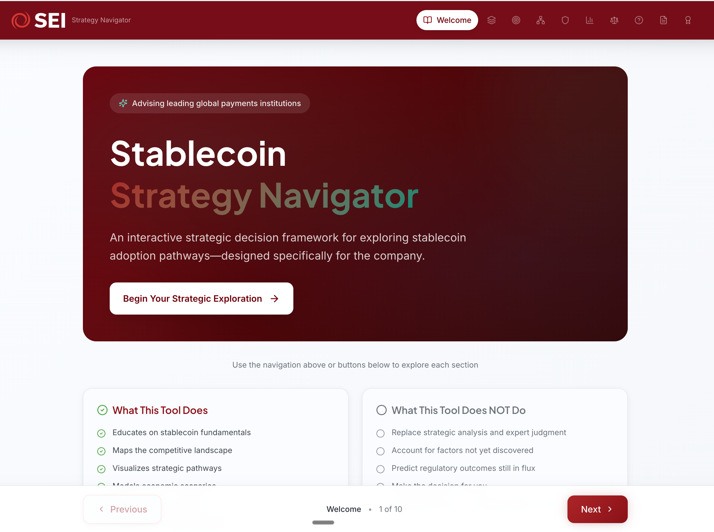
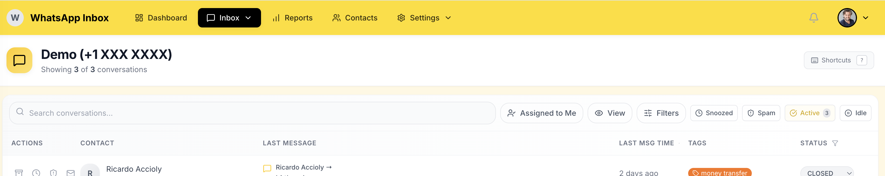
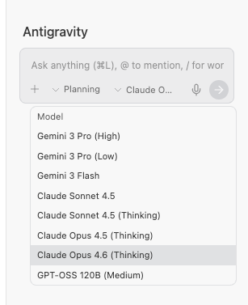

# 🌟 Phase 0 — What Is This? (And Will It Break My Computer?)

> **Read time: ~15 minutes** | This is the most important page in the whole guide.
> Before installing anything, before touching any settings — let's talk about what this is, what it can do, and why you don't need to be afraid of it.

---

## 1. Welcome

Hi. 👋

If you're reading this, someone thought you'd benefit from a tool that lets you build real software — websites, dashboards, business tools — without writing any code yourself.

That probably sounds too good to be true. Or maybe it sounds terrifying. Either way, that's normal. Let's address both.

**Here's the deal:**
- You will **not** need to learn to code
- You will **not** break your computer
- You **will** be able to build things you never thought possible

This guide exists to earn your trust before asking you to do anything. No rushing. No jargon. Just a conversation about what this tool is and whether it's right for you.

---

## 2. What Is Antigravity?

Think of Antigravity as having a **full engineering team sitting next to you**, ready to work whenever you are — day or night. You talk to it in plain English, and it builds real software for you.


Here's what it can do:

- **Build complete applications** — websites, dashboards, business tools, databases — from a conversation
- **Read and understand code** — it navigates your entire project like a senior developer would
- **Run things on your computer** — installs tools, starts servers, runs tests (always asks permission first)
- **See your screen** — send it a screenshot and it instantly understands layout, colors, spacing, and bugs
- **Browse the web** — looks up documentation, APIs, and best practices
- **Test in a real browser** — with the Chrome extension, it can open your app, click buttons, fill forms, and verify everything works
- **Remember what it learns** — it gets smarter about your projects over time by remembering patterns, preferences, and past decisions
- **Call in specialists** — 25 built-in "expert agents" that each focus on one job (security, performance, testing, design, etc.)

### The Key Idea

> **You are the boss. Antigravity is your engineering team.**
>
> You describe what you want in everyday language. Antigravity figures out how to build it, shows you a plan, and only proceeds when you say "go ahead."

You don't need to know how to code. You don't need to know what JavaScript is, or what a database looks like, or how websites work under the hood. You just need to know **what you want to build** and **who it's for**.

---

## 3. What Can It Actually Build?

Let's look at real projects — all built by someone with **zero programming experience**, using only Antigravity:

---

### 🏢 "Nonprofit Community Portal"

**What it is:** A complete 15-page website for a real nonprofit organization — with a content management system, volunteer and client application portals, and full bilingual support (English and Spanish).

**Why it's impressive:** This isn't a template. It's a custom-built, professional website for a real organization with real users. It has a blog, FAQ, contact forms, and an admin panel to manage content.

**What the user said to start building it:**
> *"I need a website for a nonprofit that helps connect volunteers with clients in Atlanta. It should have pages for volunteers to apply, clients to request help, and an about page with our history since 1995. Support English and Spanish."*

That's it. One paragraph. Antigravity built the entire thing.


---

### 🎯 "Interactive Strategy Presentation"

**What it is:** An interactive web-based presentation tool that replaced a traditional PowerPoint. Features decision trees, interactive sliders for financial modeling, and animated charts that respond to user input.

**Why it's impressive:** This wasn't a slideshow — it was a fully interactive web application where executives could drag sliders to model costs, click through decision trees, and explore data at their own pace.

**What the user said to start building it:**
> *"I need to present a strategy for stablecoin adoption to a credit union. Instead of a boring PowerPoint, I want an interactive web experience where they can explore pathways, see costs with sliders, and visualize regulatory timelines."*



---

### 💬 "Customer Support Inbox"

**What it is:** A live production system that handles real customer messages in real-time. Includes a CRM (customer database), agent assignment and management, SLA tracking (response time goals), and performance analytics dashboards.

**Why it's impressive:** This is running in production right now, handling actual customer conversations. It has real-time updates, performance reports, and supports multiple agents working simultaneously.

**What the user said to start building it:**
> *"I need a WhatsApp inbox system where agents can see incoming messages, respond, manage contacts, and track SLA performance. It should have a dashboard with real-time metrics."*



---

> **The pattern you should notice:** In every case, the user described what they wanted in plain English — and Antigravity built a complete, professional, production-ready application. No coding. No templates. Custom software.

---

## 4. How Does It Work?

Antigravity works through **conversation**. You literally type what you want, and it responds, plans, and builds. Here's the cycle:

```
┌──────────────────────────────────────────────────────────────┐
│                                                              │
│   1. 💬 You describe what you want (in plain English)        │
│                        ↓                                     │
│   2. 📋 Antigravity creates a plan (shows you the files      │
│         it will create and the approach it will take)        │
│                        ↓                                     │
│   3. 👀 You review the plan                                  │
│         → "Looks good, proceed"                              │
│         → "Change this..." (it adjusts)                      │
│                        ↓                                     │
│   4. 🔨 Antigravity builds it                                │
│                        ↓                                     │
│   5. 🖥️ You see it in your browser                           │
│                        ↓                                     │
│   6. 💬 You say what to change                               │
│         → "Make the button blue"                             │
│         → "Add a search bar"                                 │
│         → "That table needs sorting"                         │
│                        ↓                                     │
│   7. 🔄 Repeat steps 4-6 until you're happy                  │
│                        ↓                                     │
│   8. ✅ Deploy it (put it on the internet)                    │
│                                                              │
└──────────────────────────────────────────────────────────────┘
```

**The most important part:** Step 3. Antigravity always shows you what it plans to do **before doing it**. Nothing happens without your approval. You are always in control.

---

## 5. Safety & Trust

Let's address the fears directly. Every single one of them.

---

### "Can it break my computer?"

**No.** Here's why:

- Antigravity only works inside the **folder you open**. It can't touch your photos, documents, desktop, or anything else.
- Before making any changes, it **shows you a plan** and waits for your approval.
- Before running any command on your computer, it **asks for permission** — you see exactly what it's about to do.
- There's a built-in rule: if it wants to change more than 3 files, it **stops and asks** before proceeding.

Think of it like a contractor working on your kitchen. They can't wander into your bedroom — they're restricted to the room you hired them for. And they always show you the blueprint before picking up a hammer.

---

### "Can it access my personal files?"

**Only the folder you open.** When you open a folder in Antigravity, that folder becomes the "workspace." Everything outside of it is invisible to the tool.

Your photos, bank documents, emails — none of that is accessible. It's like giving a key to a single room in your house.

---

### "What if I say the wrong thing?"

**There are no wrong inputs.** You can:
- Be vague ("make it look nicer") — it will ask clarifying questions
- Be specific ("change the button color to #3B82F6") — it will do exactly that
- Ask a question ("what does localhost mean?") — it will explain
- Say "I don't know" — it will suggest options
- Say "stop" or "that's not what I meant" — it will stop and listen

The worst that can happen is it builds something you don't like — and then you just say "change it" or "undo that."

---

### "Will it cost me money?"

**Not to get started.** Here's the breakdown:

| What | Cost |
|---|---|
| Antigravity itself | Free to download and use |
| Node.js (required tool) | Free, open-source |
| Git (required tool) | Free, open-source |
| Building and testing locally | Free (runs on your computer) |
| AWS hosting (when you deploy) | Free tier covers most prototypes for 12 months |

The only costs come later when you want to put something on the internet for others to use — and even then, AWS's free tier is very generous for small projects.

---

### "What if the code is bad?"

Antigravity has **built-in quality gates** that prevent bad code from going live:

| Safety Check | What It Does |
|---|---|
| **Pre-Implementation Checklist** | Before writing any code, it researches your existing project and shows you a plan. You approve before anything changes. |
| **`/preflight`** | Before deploying, this runs automated checks — does the code compile? Do tests pass? Are there security issues? |
| **`/sentinel`** | Specifically scans for security vulnerabilities — hardcoded passwords, exposed API keys, known dependency issues. |
| **`/architect`** | Reviews your entire project architecture and scores it across 6 dimensions. Tells you exactly what to improve. |

Think of these like a building inspector who checks the electrical, plumbing, and structure before you move in. You don't need to understand what they're checking — you just need to know they're checking it.

---

## 6. Key Concepts — Explained Like You're Explaining to a Friend

Before we go any further, let's define some terms you'll encounter. None of these are complicated — they just have unfamiliar names.

| Term | What It Actually Is |
|---|---|
| **Terminal** | A way to type commands to your computer. Think of it like texting your computer — you type a command, it does something, and it texts back what happened. On Windows it's called "PowerShell," on Mac it's called "Terminal." |
| **Localhost** | Your computer pretending to be a website, just for you. When you build a website, you can see it on your own computer before putting it on the internet. The address is usually something like `http://localhost:3000`. Only you can see it — nobody else. |
| **Server** | A computer that serves a website to the internet. When you visit google.com, a server somewhere is sending that page to your browser. When you build a website and deploy it, it goes to a server so other people can access it. |
| **Port** | Like an apartment number. Your computer is the building, and ports are the individual doors. When you see `localhost:3000`, the `:3000` means "door number 3000." Different apps use different doors so they don't conflict. |
| **Browser** | Chrome, Firefox, Edge, Safari — the app you use to view websites. You already use one every day. |
| **Code / Source Code** | Instructions written in a language that computers understand. Think of it like a recipe — except instead of a chef following it, a computer follows it. **Antigravity writes the code for you.** |
| **Repository (Repo)** | A folder where your project lives, with version history. Like a Google Doc with "version history" — you can see what changed, when, and go back to any previous version. |
| **Deploy** | The act of putting your project on the internet so other people can access it. Before deploying, only you can see your project (on localhost). After deploying, anyone with the URL can see it. |

---

## 7. The Mental Model — Your Role vs. Antigravity's Role

The easiest way to understand Antigravity is to imagine you just hired a team of expert engineers. Each person has a specialty:

| Your Role | Antigravity Equivalent | What They Do |
|---|---|---|
| **You** (the boss) | You — describing what you want | Give directions in plain language |
| **Software Architect** | `/architect` | Designs the big picture |
| **Frontend Developer** | Antigravity core | Builds what users see (screens, buttons, pages) |
| **Backend Developer** | Antigravity core | Builds what happens behind the scenes (data, logic) |
| **QA Tester** | `/stage` | Opens a browser and clicks every button to find bugs |
| **Security Engineer** | `/sentinel` | Finds and fixes security holes |
| **UX Designer** | `/palette` | Makes the interface easier and prettier to use |
| **Code Reviewer** | `/critic` | Reviews every file for quality |
| **DevOps Engineer** | `/courier` | Safely ships your code to production |
| **Performance Engineer** | `/bolt` | Makes everything faster |
| **Dependency Manager** | `/medic` | Keeps your software's building blocks healthy |

**You don't need to be any of these people.** You just need to tell them what you want.

### The 4-Step Safety Workflow

Every time you ask Antigravity to do something, it follows this process:

```
1. 🔍 RESEARCH   → Checks existing docs and code first (prevents re-inventing)
2. 📋 PLAN       → Shows you exactly what it will do (you approve or adjust)
3. 🔨 BUILD      → Makes the changes (only after your approval)
4. 📝 REVIEW     → Summarizes what changed and what docs need updating
```

This workflow is **enforced by the rules** that come with this starter kit. The AI can't skip steps — it's required to show you the plan and get your approval every time.

---

## 8. How Antigravity Actually Works (Under the Hood)

You don't need to understand this to use Antigravity — but if you're curious, or if a client or boss asks technical questions, here's the truth.

### Everything Lives on Your Computer

Antigravity stores all of its knowledge **in your project's file system** — the folders and files on your own computer. There is no external database, no cloud account, and no hidden server storing your work.

| What | Where It Lives |
|---|---|
| Your project code | Your project folder on your computer |
| AI rules and behavior | `~/.gemini/GEMINI.md` on your computer |
| Project knowledge | `AGENT-REFERENCE.md` + `docs-canonical/` in your project folder |
| Conversation memory | Knowledge files stored in `~/.gemini/` on your computer |
| Workflow definitions | `.agent/workflows/` in your project folder |
| Version history | `.git/` folder in your project (local until you push) |

**What this means:** If you delete the folder, everything is gone. If you copy the folder to another computer, everything comes with it. Your data lives where you put it — nowhere else.

You can also ask Antigravity to **search through its memory**, find previous decisions, and look across multiple projects:

```
"Search your knowledge for how we handled authentication 
in the last project."
```

### Choosing Your AI Model (LLM)

Antigravity is not one single AI — it's a **framework** that connects to different AI models. You choose which model to use, and you can switch at any time. Here are the models currently available in Antigravity:

| Model | Best For | Limits | Cost |
|---|---|---|---|
| **Gemini 3 Pro (High)** (Google) | Deep reasoning, complex building sessions | Very generous limits | Free tier available |
| **Gemini 3 Pro (Low)** (Google) | Everyday tasks, quick changes | Most generous limits | Free tier available |
| **Gemini 3 Flash** (Google) | Fast, simple tasks, quick answers | Very generous limits | Free tier available |
| **Claude Sonnet 4.5** (Anthropic) | Great balance of speed and quality | Generous for most work | Included in $20/month plans |
| **Claude Sonnet 4.5 (Thinking)** (Anthropic) | Step-by-step reasoning with explanations | Moderate limits | Included in $20/month plans |
| **Claude Opus 4.5 (Thinking)** (Anthropic) | Deepest reasoning, best code quality | Reaches limits faster | Included but limited |
| **Claude Opus 4.6 (Thinking)** (Anthropic) | Latest and most capable Claude model | Reaches limits faster | Included but limited |
| **GPT-OSS 120B (Medium)** (OpenAI) | Open-source alternative, good for variety | Generous limits | Free |

**My recommendation for getting started:** Start with **Gemini 3 Pro (High)** — it's free, powerful, and has the most generous limits. When you want the absolute best code quality, switch to **Claude Opus 4.6 (Thinking)**. You can always switch back if you hit limits.

> **You can switch models mid-project.** Start a conversation with one model, and if you hit limits, switch to another. Your project files stay the same — only the AI engine changes.



### Data Privacy & Security

This is the question clients and bosses always ask: **"Is my data being shared with Google or Anthropic?"**

Here's the honest, accurate answer:

| What Happens | Details |
|---|---|
| **Your code files are sent to the AI** | When you chat, Antigravity sends relevant parts of your project to the AI model so it can understand and help. This is necessary — the AI can't help with code it can't see. |
| **The AI provider processes your request** | Google (Gemini) or Anthropic (Claude) processes your message and code to generate a response. |
| **API usage is NOT used for training** | Both Google and Anthropic's API terms state that API inputs/outputs are **not** used to train their models. Your code does not become part of the AI's general knowledge. |
| **No data is stored permanently by the provider** | API requests are processed and discarded. They are not saved in a database by Google or Anthropic for future use. |
| **Your project files stay on your computer** | The files themselves never leave your machine. Only the content of messages you send (which may include code snippets) goes to the AI during the conversation. |

**In plain English:** Your code is sent to the AI so it can help you, then it's discarded. It's like calling a consultant on the phone — they hear what you say during the call, but they don't record it or share it with other clients.

> [!IMPORTANT]
> **For enterprise and regulated environments:** If your organization has strict data handling requirements, check with your IT/security team. Both Anthropic and Google offer enterprise plans with additional data protection agreements (DPAs), SOC 2 compliance, and data residency options.

---

## 9. How to Talk to AI — It's Easier Than You Think

A lot of people don't know how to "talk to AI" and worry they'll say the wrong thing. Let's fix that right now with real examples.

### The Golden Rule

**Describe the "what" and "why," not the "how."**

| Instead of this... | Say this... |
|---|---|
| *"Create a REST API with CRUD endpoints"* | *"I need a backend that lets me create, read, update, and delete customers"* |
| *"Add a React component with state management"* | *"Add a counter on the dashboard that shows how many orders came in today"* |
| *"Implement OAuth2 authentication"* | *"Users should log in with their Google account"* |
| *"Set up CI/CD pipeline"* | *"Every time I push code, I want it to automatically deploy"* |

### When It Goes the Wrong Direction

This will happen. The AI misunderstands sometimes — just like a human team member would. Here's exactly what to say:

**Scenario 1: It's building the wrong thing**
> ❌ AI starts building a mobile app when you wanted a website
>
> ✅ Say: *"Stop. That's not what I meant. I want a website, not a mobile app. Let me clarify — it should be a web dashboard that works in the browser."*

**Scenario 2: It's overcomplicating things**
> ❌ AI proposes a complex architecture with 15 files when you need something simple
>
> ✅ Say: *"That seems way over-engineered for what I need. Can we do a much simpler version? I just need a single page with a form and a list."*

**Scenario 3: It's not listening to your preference**
> ❌ AI keeps using a light theme when you asked for dark
>
> ✅ Say: *"I specifically asked for a dark theme. Please change everything to dark mode — dark background, light text. This is a requirement, not a suggestion."*

**Scenario 4: You don't understand what it's doing**
> ❌ The plan is full of technical terms you don't recognize
>
> ✅ Say: *"I don't understand this plan. Can you explain it to me like I'm a complete beginner? What does each step actually do, in plain English?"*

**Scenario 5: You want to undo something**
> ❌ The last change broke something or you don't like it
>
> ✅ Say: *"Undo the last change. The previous version was better. Let's go back to how it was before."*

### Key Phrases to Remember

| Situation | What to Say |
|---|---|
| Stop it mid-task | *"Stop. Let me re-explain."* |
| Start over | *"Let's start fresh. Here's what I actually want..."* |
| Need explanation | *"Explain that in simple terms."* |
| Too complex | *"Simpler please. Do the minimum."* |
| Not what you wanted | *"That's not what I meant. I want X, not Y."* |
| Looks good | *"Proceed"* or *"Looks good, go ahead."* |
| Want options | *"Show me 2-3 approaches and explain the trade-offs."* |
| Check quality | *"Run /preflight to make sure this is solid."* |
| Show what you see | *Take a screenshot and paste it into the chat* |

### 🖼️ Your Secret Weapon: Screenshots

This is one of the most powerful things most people don't know: **Antigravity understands images.** A single screenshot is worth more than a paragraph of description.

**How it works:** Take a screenshot of what you see in your browser, paste it into the Antigravity chat, and describe what's wrong or what you want changed. The AI instantly sees:
- The exact layout, spacing, and colors
- Which elements are misaligned or wrong
- What the current state looks like vs. what you want

**When to use screenshots:**

| Situation | What to Do |
|---|---|
| Something doesn't look right | Screenshot it + *"This doesn't look right. The sidebar should be narrower and the header should be sticky."* |
| You want it to look like another website | Screenshot the website you admire + *"Make it look like this."* |
| There's a bug on screen | Screenshot the error + *"I see this error. Fix it."* |
| You want to compare before/after | *"Here's what it looks like now [screenshot]. I want it to look like this instead [second screenshot]."* |
| The console shows red errors | Screenshot the browser console + *"These errors are showing. What's wrong?"* |

**How to take a screenshot:**
- **Windows:** `Win + Shift + S` → select the area → paste into chat with `Ctrl + V`
- **Mac:** `Cmd + Shift + 4` → select the area → drag the file into the chat (or use `Cmd + Shift + 3` for full screen)

> **Pro tip:** Don't just screenshot the whole screen — crop to the specific area that's relevant. This helps the AI focus on exactly what you're talking about.

> **Remember:** There is literally no wrong thing to say. The AI will always try to understand and adapt. If it gets confused, just say "let me explain again" and restate what you want.

---

## 10. Gallery: See What's Possible

The three projects shown in [Section 3](#3-what-can-it-actually-build) above are real — built by a non-programmer using only Antigravity. Go back and read them if you skimmed, because they prove this isn't a toy.

Here's what all those projects have in common:

| What the user did | What Antigravity did |
|---|---|
| Described the project in plain English | Built the entire codebase |
| Said "change this" when something wasn't right | Made the adjustments |
| Ran `/preflight` before deploying | Caught bugs and issues automatically |
| Ran `/sentinel` for security | Found and fixed vulnerabilities |
| Used `/courier` to deploy | Committed code and pushed to production |

**The user never wrote a single line of code.** They just described, reviewed, and directed — like a boss managing a team.

---

## 11. I'm Ready — What's Next?

If you've read this far and you're thinking *"OK, I want to try this"* — great! Here's where to go next:

> **Option A: Just type `/start`**
> If you opened this folder in Antigravity, type `/start` in the chat. The tool will walk you through everything — checking your computer, setting things up, and building your first project.

> **Option B: Keep reading the guide**
> If you want to learn more before doing anything, continue to [Phase 1: Setup Your Computer](phase-1-setup-your-computer.md). You'll learn what tools you need and how to install them.

Either way, you're in control. Take your time. There's no rush.

---

> *This guide is part of the Coach Gravity Starter Kit — built to help anyone, regardless of technical background, build real software with Antigravity AI.*
