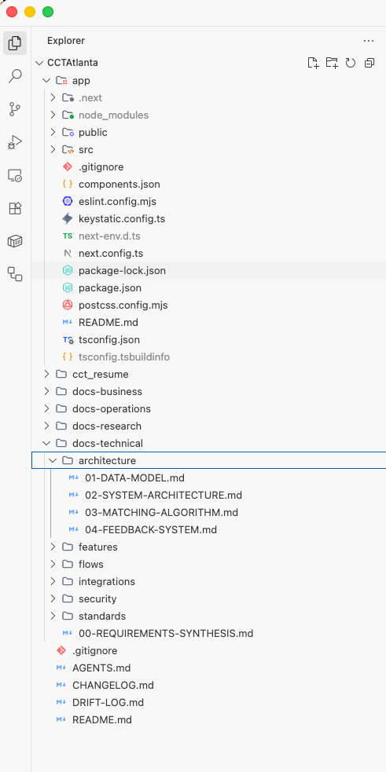
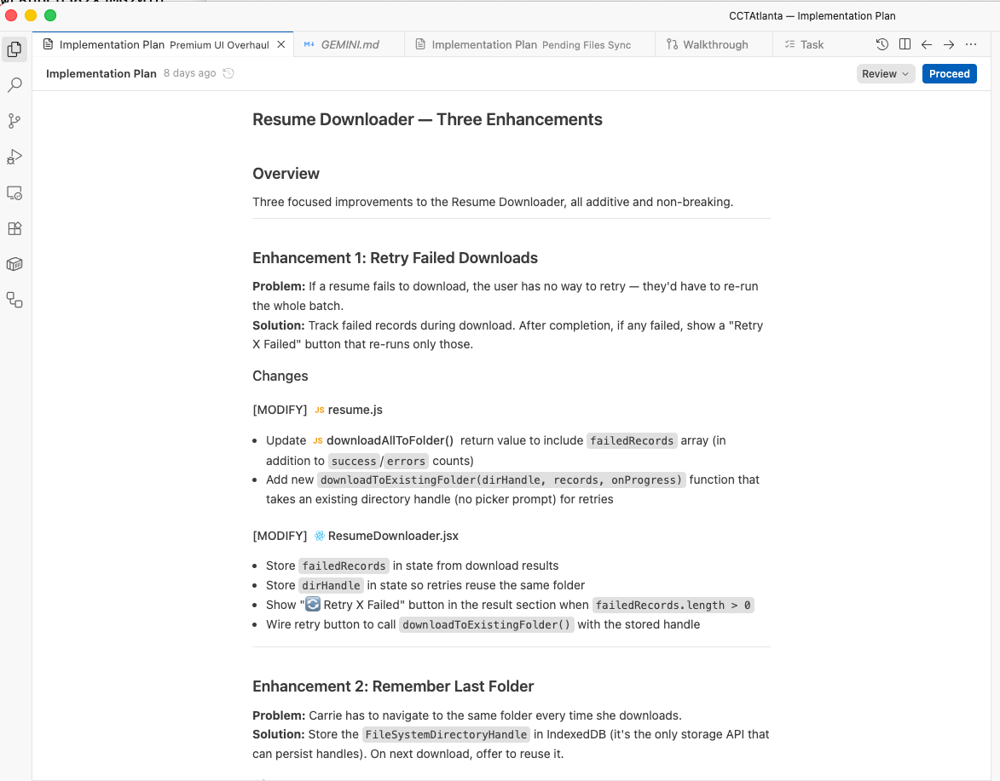
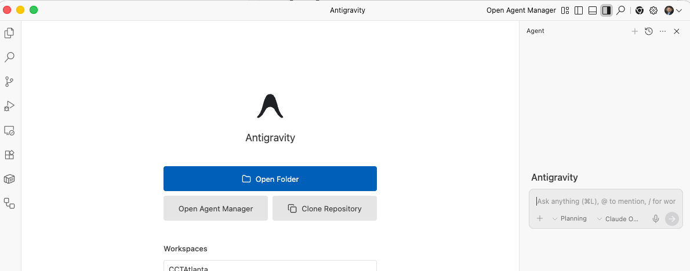

# 🔧 Phase 2 — Install & Configure Antigravity

> **Read time: ~10 minutes** | **Do time: ~10 minutes**

---

> **🏁 Ready Check — Can I skip this section?**
>
> ✅ Skip if: Antigravity is installed, you've opened this folder in it, and your global config files (`~/.gemini/GEMINI.md`) are already in place
> 📖 Read if: This is your first time using Antigravity
>
> Not sure? If you're reading this outside of Antigravity, you haven't set up yet. Read on.

---

## Step 1: Open This Folder in Antigravity

If you followed the email/instructions you received, you should have:
1. Downloaded and installed Antigravity
2. Downloaded and unzipped the `coach_gravity` folder

Now:
1. Open Antigravity
2. Click **File → Open Folder** (or drag the folder onto the Antigravity window)
3. Navigate to your `coach_gravity` folder and select it

**What you should see:** The file explorer on the left showing this folder's contents, and a chat panel where you can type.



---

## Step 2: Set Up Global Configuration

Antigravity uses three special files to know how you want it to behave. These files go in a **global** location so they apply to every project you work on.

### What Are These Files?

| File | What It Does |
|---|---|
| **`GEMINI.md`** | Rules for the AI — like a contract. It tells Antigravity: always show a plan first, never change more than 3 files without asking, always check existing code before writing new code. |
| **`CLAUDE.md`** | Same rules, alternative format. Some versions of Antigravity read this file instead. Having both ensures the rules work regardless of which AI engine is used. |
| **`agreement.md`** | An operating agreement between you and the AI — defines your working relationship, approval requirements, and safety protocols. |

### How to Install Them

**The `/start` workflow does this for you automatically.** If you type `/start` in the chat, it will copy these files to the right place and explain what it's doing.

If you want to do it manually:

**Windows (PowerShell):**
```powershell
# Create the global config directory
New-Item -ItemType Directory -Force -Path "$env:USERPROFILE\.gemini"

# Copy the global config files
Copy-Item "starter-kit\global\GEMINI.md" "$env:USERPROFILE\.gemini\"
Copy-Item "starter-kit\global\CLAUDE.md" "$env:USERPROFILE\.gemini\"
Copy-Item "starter-kit\global\agreement.md" "$env:USERPROFILE\.gemini\"
```

**Mac/Linux (Terminal):**
```bash
# Create the global config directory
mkdir -p ~/.gemini

# Copy the global config files
cp starter-kit/global/GEMINI.md ~/.gemini/
cp starter-kit/global/CLAUDE.md ~/.gemini/
cp starter-kit/global/agreement.md ~/.gemini/
```

### What These Rules Enforce

Here's a real example. With these rules in place, every time you ask Antigravity to do something, it **must** respond with this before writing any code:

```
## Pre-Implementation Checklist
- Docs reviewed: [which files it checked]
- Existing patterns found: [what it found in your code]
- Proposed approach: [what it plans to do]
- Files to change: [exact list]
- Risk level: LOW | MEDIUM | HIGH

Waiting for approval to proceed.
```

**You don't have to do anything to make this happen.** The rules file does it automatically. All you do is review the plan and say "proceed" or "change this."



> [!CAUTION]
> **Don't remove the approval gates** from `GEMINI.md` or `CLAUDE.md` unless you fully understand what they do. These rules protect you from the AI making changes you didn't approve.

### Customizing Your AI's Behavior

`GEMINI.md` is **how you control your AI.** Think of it as writing a job description for your engineering team — you tell them your preferences, your rules, and how you want them to work.

**You can add your own rules at any time.** Open `~/.gemini/GEMINI.md` in any text editor and add lines like:

```markdown
## My Preferences
- Always use dark mode for new projects
- Default to Next.js for web applications
- Write all comments in Portuguese
- Keep code files under 200 lines
- Always suggest mobile-responsive designs first
```

**Example customizations people make:**

| What You Want | Rule to Add |
|---|---|
| Always explain in simple terms | `Always explain technical decisions in plain English, as if talking to a non-programmer.` |
| Prefer certain technologies | `When building web apps, default to Next.js with TypeScript.` |
| Set a coding style | `Use meaningful variable names. No single-letter variables.` |
| Add a language preference | `Write all user-facing text in Brazilian Portuguese.` |
| Enforce a workflow | `Always run /preflight before committing any changes.` |

**To edit your rules:**
1. Open `~/.gemini/GEMINI.md` in Antigravity or any text editor
2. Add your rules in plain English — no special syntax needed
3. Save the file
4. The new rules take effect in your next conversation

> **The important thing to understand:** `GEMINI.md` is how you shape the AI's personality and work style. The starter kit comes with safety rules pre-installed. You keep those and **add** your own preferences on top.

---

## Step 3: Understand the Per-Project Files

When you start a new project (which Phase 3 will cover), you'll also use these files:

| File | What It Does |
|---|---|
| **`AGENT-REFERENCE.md`** | Your project's "brain" — tells the AI what your project is, what technologies it uses, what folders exist, and how things are organized. The more detail here, the smarter it is. |
| **`.agent/workflows/*.md`** | The 25 slash commands. Each file defines one workflow — what it checks, what it runs, and in what order. You can customize any of them. |

You don't need to worry about these yet — Phase 3 and Phase 4 will walk you through them.

---

## Step 4: Your First Interaction

With the config files in place, let's make sure everything works.

In the Antigravity chat, type:

```
Hello! Can you confirm you can see the files in this project?
```

Antigravity should respond by listing the files and folders it can see. This confirms:
- ✅ It's reading this folder
- ✅ Your configuration files are working
- ✅ You're ready to go



---

## Step 5: Install the Chrome Extension

Antigravity has a **Google Chrome extension** that gives it the ability to see and interact with your browser. This is what powers the `/stage` workflow — letting Antigravity open your app, click buttons, fill out forms, and test everything for you.

### What It Does

| Without Extension | With Extension |
|---|---|
| Antigravity can only read your code files | Antigravity can **see** your running app in the browser |
| You describe what's on screen in words | It sees exactly what you see |
| Manual testing only | Automated browser testing via `/stage` |
| You have to describe visual bugs | It can spot visual issues itself |

### How to Install

1. Open **Google Chrome** (download from [google.com/chrome](https://google.com/chrome) if you don't have it)
2. Go to the Chrome Web Store page for the Antigravity extension
3. Click **Add to Chrome**
4. Click **Add Extension** when prompted
5. You'll see a small Antigravity icon in your browser toolbar

> **Note:** The extension only activates when Antigravity is running and you use browser-related features like `/stage`. It doesn't track your browsing or run in the background.

### Why This Matters

With the extension installed, you can use the `/stage` command:

```
/stage
```

This makes Antigravity open your app in a real browser, navigate through pages, click every button, fill out forms, and report back what works and what's broken — like having a QA tester sit next to you and test everything.

---

## What Just Happened?

Let's recap what we set up and why:

| What | Why |
|---|---|
| Opened the folder in Antigravity | So the AI knows what project to work on |
| Copied global config files | So the AI follows safety rules (show plans, get approval) |
| Said hello and tested | So we know everything is working |
| Installed the Chrome extension | So Antigravity can see and test your app in the browser |

**That's it.** Your computer is now set up to build real software with AI.

---

## Checkpoint ✅

At this point, you should have:

- [x] Antigravity installed and open
- [x] This folder (`coach_gravity`) open in Antigravity
- [x] Global config files installed (`GEMINI.md`, `CLAUDE.md`, `agreement.md`)
- [x] Successfully communicated with Antigravity in the chat
- [x] Chrome extension installed

**Next:** [Phase 3 — Plan Before You Build →](phase-3-plan-your-project.md)
