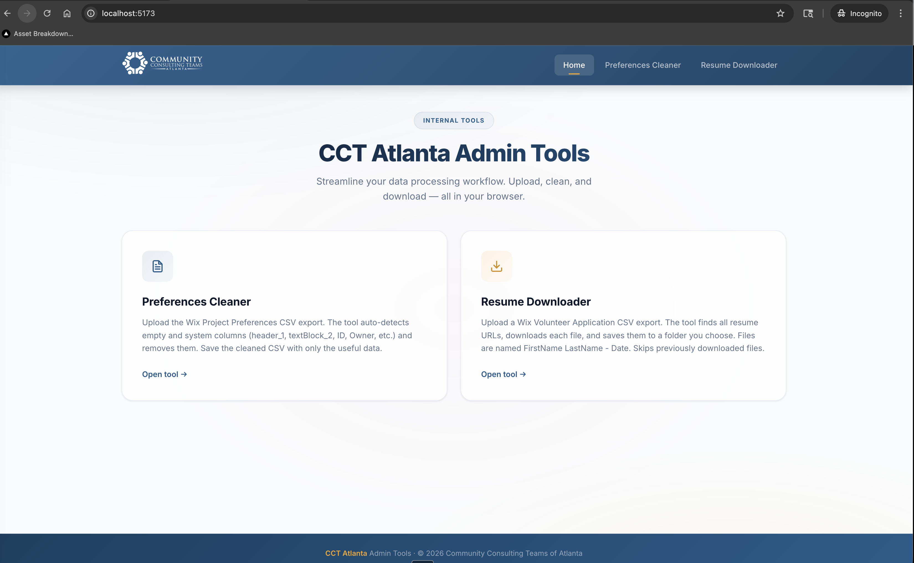
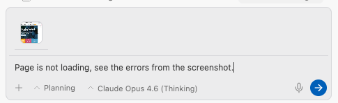
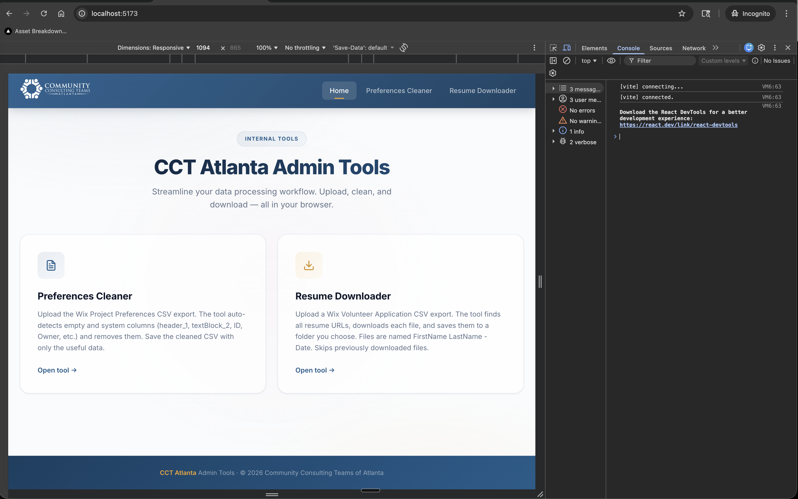

# 🔨 Phase 5 — Build Your Project

> **Read time: ~10 minutes** | **Do time: ~30-60 minutes** | ❌ **Core experience — don't skip this.**

---

## What We're Going to Do


In this phase, you'll go from an idea to a working application visible in your web browser. Here's the journey:

```
📋 Your answers from Phase 4
         ↓
📁 Antigravity creates your project folder
         ↓
🔨 Antigravity builds your application
         ↓
🖥️ You see it running in your browser
         ↓
💬 You say what to change
         ↓
🔄 Antigravity makes adjustments
         ↓
✅ You have a working app!
```

---

## Step 1: Create Your Project

If you've answered the questionnaire from Phase 4 (either through `/start` or by filling it out manually), tell Antigravity to scaffold your project:

```
Create a new project based on my questionnaire answers. 
Set up the folder structure, documentation, and initial code.
```

Antigravity will:
1. **Create a new folder** for your project (e.g., `my-project/`)
2. **Generate documentation** (`AGENT-REFERENCE.md`, `docs-canonical/`, etc.)
3. **Set up the project configuration** (package.json, etc.)
4. **Create the initial code files** (pages, components, styles)

**🔍 What to look for:** Antigravity will show you a plan before creating anything. Review it — does it match what you described? If something seems off, say so now. It's much easier to fix a plan than to fix built code.

> 🛡️ **Don't be nervous.** Even if the plan looks unfamiliar, you don't need to understand every technical detail. Focus on: Does the list of features match what I asked for? If yes, say "proceed." If something is missing or wrong, just say so.

---

## Step 2: See It Running


Once Antigravity builds the initial version, it will start the application:

```
Run the app so I can see it in my browser.
```

Or use the workflow:
```
/launch
```

**What happens next:**
- Antigravity starts a local server on your computer
- It gives you a URL like `http://localhost:3000`
- You open that URL in your browser (Chrome, Firefox, etc.)
- You see your application!



### Wait — What Is "localhost"?

Remember from [Phase 0](phase-0-trust-and-setup.md)?

> **Localhost** = your computer pretending to be a website, just for you.

When you see `localhost:3000` in your browser:
- `localhost` = your own computer
- `:3000` = the "door number" (port) the app is using
- **Only you can see it.** Nobody else on the internet can access this.

It's like a dress rehearsal before opening night. The show is for your eyes only until you decide to "deploy" it (put it on the real internet).

> 🤔 **What just happened?** Antigravity compiled your code, started a mini web server on your computer, and told your browser where to find it. The URL `localhost:3000` is like a private address that only exists on your machine. Nobody else can see it, and closing the terminal stops the server.

---

## Step 3: Review and Adjust

Now the fun part begins. Look at what Antigravity built and start directing changes:

### What to Look For

| Area | Questions to Ask Yourself |
|---|---|
| **Layout** | Is the overall structure right? Header, sidebar, main content? |
| **Navigation** | Can you get to all the pages? Does the flow make sense? |
| **Content** | Are the right sections and fields showing? |
| **Style** | Does it look good? Match the vibe you described? |
| **Functionality** | Do buttons work? Can you fill out forms? |

### How to Give Feedback

**Be specific and visual.** Instead of "I don't like it," try:

| Vague (harder for AI) | Specific (better results) |
|---|---|
| *"Make it look better"* | *"The header should be darker and the logo should be on the left"* |
| *"Fix the layout"* | *"The sidebar is too wide. Make it 250px and put the nav items closer together"* |
| *"Add more features"* | *"Add a search bar at the top of the customer list page"* |
| *"The colors are wrong"* | *"Use a dark navy (#1a1a2e) background with white text and blue (#3B82F6) for buttons"* |

### 🖼️ The Power Move: Screenshots

**This is the single most effective way to give feedback.** Instead of describing what's wrong, take a screenshot and paste it into the chat:

```
[paste screenshot]
"See this? The spacing between these cards is too tight, 
and the button should be blue, not gray. Fix it."
```

Antigravity understands images incredibly well. A screenshot eliminates ambiguity — it sees exactly what you see.



**How to take a screenshot:**
- **Windows:** `Win + Shift + S` → select area → paste with `Ctrl + V`
- **Mac:** `Cmd + Shift + 4` → select area → drag file into chat

> **Pro tip:** If you see a website you love and want your app to look similar, screenshot that website and share it: *"Make my landing page look like this [screenshot]."*

### Real Feedback Loop Example

Here's what a typical iteration looks like:

```
You: "The dashboard looks good, but the chart is too small. 
      Make it take up the full width of the page. 
      Also, the font is too small — can we use 16px as the base?"

Antigravity: [Shows plan to modify the chart component and global styles]

You: "Proceed"

Antigravity: [Makes changes, reloads the app]

You: "Better! Now add a filter dropdown above the chart so users 
      can select a date range."

Antigravity: [Shows plan for the filter component]

You: "Looks good, go ahead."
```

Each cycle takes just a few minutes. After 5-10 iterations, you'll have something that closely matches your vision.

> 🤔 **What just happened?** You just used the core feedback loop: describe → review → adjust → repeat. Each round gets you closer to your vision. The first version is never perfect — that's expected. The magic is in how quickly you can iterate.

> 🛡️ **It's OK to change your mind.** You can change direction at any point. There's no "wasted work" — Antigravity builds fast, so starting over or going in a new direction is totally fine.

---

## Step 4: Quality Check

Before celebrating, let's make sure the code is solid. Type:

```
/preflight
```

This runs an **automated quality check** that verifies:
- ✅ The code compiles without errors
- ✅ There are no obvious bugs
- ✅ The project structure follows best practices
- ✅ No security issues are visible

Think of it like a building inspector visiting the construction site. You don't need to understand what they check — you just need to see a passing grade.


> If `/preflight` finds issues, Antigravity will explain them and offer to fix them. Just say "fix all issues" and review the changes.

You can also run `/stage` to have Antigravity **open a real browser**, navigate your app, click buttons, and test everything automatically — like having a QA tester on demand. (This requires the Chrome extension from [Phase 0](phase-0-trust-and-setup.md#step-3-install-the-chrome-extension).)

---

## What You Just Accomplished


Let's take a moment to appreciate what happened:

1. You **described a project** in plain English
2. Antigravity **planned and built it** for you
3. You **saw it running** in your browser
4. You **gave feedback** and it **made changes**
5. You **ran quality checks** to make sure it's solid

**You just built real software.** Not a template. Not a drag-and-drop page. Actual, custom-built code that does what you want.

> 🤔 **What just happened?** You went through the complete software development cycle: plan → build → review → iterate → quality check. Professional developers do this same loop every day. The only difference is they write the code themselves — you described it in plain English.

> 🎬 **Video companion:** There's a short audio walkthrough covering the build process. See `delivery/video-guide.md` for details.

---

## Common First-Time Issues

| Problem | Solution |
|---|---|
| "I see a blank white page" | Check the terminal — there might be an error. Tell Antigravity: "I see a blank page. Check the terminal for errors." Or **open the browser console** (see below) and screenshot any red errors. |
| "The URL doesn't work" | Make sure the server is running (check the terminal). Try refreshing the page or using a different browser. |
| "It looks nothing like what I described" | **Take a screenshot** and share it with Antigravity: *"[screenshot] This isn't what I described. I want it to look like X."* Or share a screenshot of a website you do like. |
| "I made too many changes and it's broken" | Tell Antigravity: "Something broke. Can you undo the last few changes and start from a working state?" |
| "It's asking me to install something" | Read what it's asking and say "yes" or ask what it does first. Everything is safe — it's just project dependencies. |
| "I see red errors but don't understand them" | Open the **browser console** (see below), screenshot the errors, and paste them into the chat. |

### 🔍 The Browser Console — Your Debugging Window

The browser has a hidden panel called the **console** that shows errors and messages. This is incredibly useful when something isn't working right.

**How to open it:**
- **Chrome/Edge:** Press `F12` or `Ctrl + Shift + J` (Windows) / `Cmd + Option + J` (Mac)
- **Firefox:** Press `F12` or `Ctrl + Shift + K` (Windows) / `Cmd + Option + K` (Mac)
- **Safari:** Enable Developer menu first (Preferences → Advanced → Show Develop menu), then `Cmd + Option + C`

**What you'll see:** A panel at the bottom of the browser with tabs (Console, Elements, Network, etc.). The **Console** tab is the most useful.

**What to look for:**
- 🔴 **Red text** = errors (something broke)
- 🟡 **Yellow text** = warnings (something might be wrong)
- ⚪ **White/gray text** = normal messages (informational)




**What to do with it:** Screenshot any red errors and paste them into the Antigravity chat:

```
[screenshot of console errors]
"I see these errors in the browser console. Can you fix them?"
```

Antigravity will read the error messages and know exactly what's wrong. You don't need to understand the errors yourself — just share them.

---

## Checkpoint ✅

At this point, you should have:

- [x] A running application visible in your browser
- [x] A basic understanding of the feedback loop (describe → review → adjust)
- [x] A passing `/preflight` check
- [x] Confidence that you can iterate and improve

**Next:** [Phase 6 — Iterate & Improve →](phase-6-iterate-and-improve.md)
