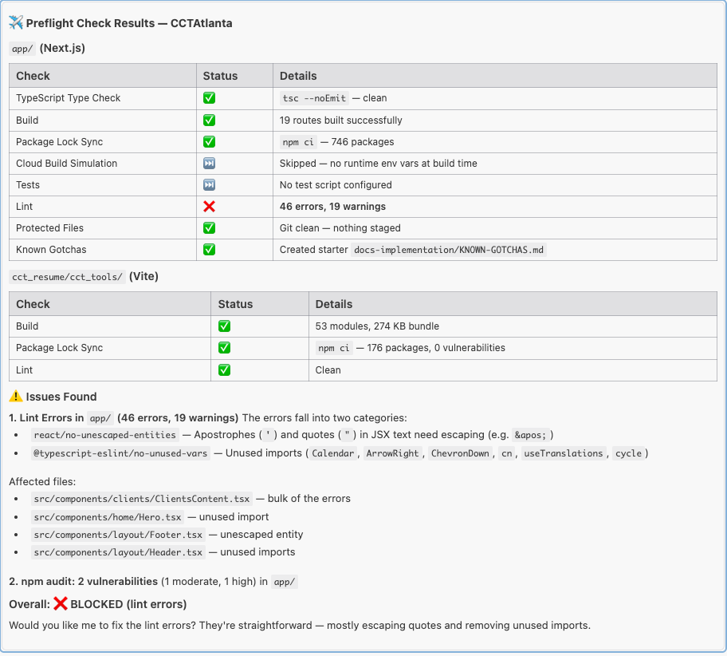
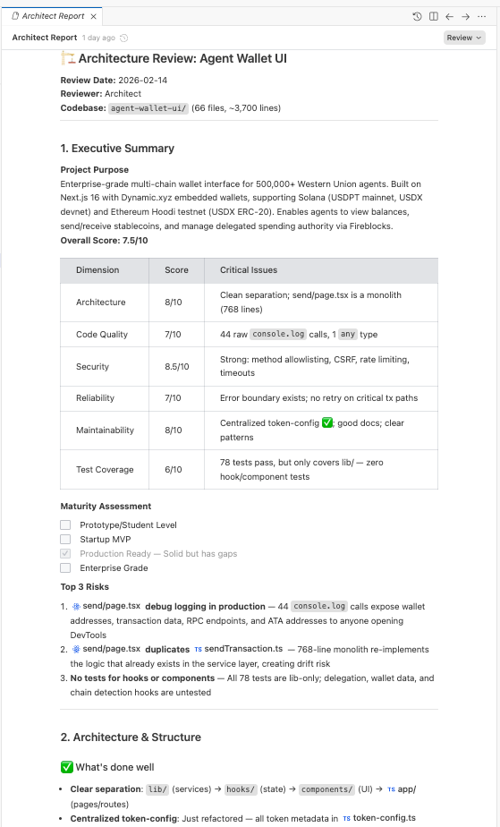

# 🔄 Phase 6 — Iterate & Improve

> **Read time: ~15 minutes** | ✅ **Can be revisited later as you need specific workflows.**

---

> **🏁 Ready Check — Can I skip this section?**
>
> ✅ Skip if: You're familiar with the 25 slash commands and know how to run quality workflows
> 📖 Read if: You've never used `/preflight`, `/sentinel`, or `/architect`
>
> At minimum, read the **Enterprise-Ready Quality Gates** section — it teaches you how to make your code professional enough for a client's enterprise architect to review.

---

## The Iteration Cycle


Building software is never "build once and done." Even professional teams iterate constantly. The cycle looks like this:

```
Build → Review → Adjust → Quality Check → Repeat
```

Antigravity makes this cycle fast — measured in minutes, not days. Here's how to use the tools effectively.

---

## Your Toolbox: The 25 Slash Commands


Think of slash commands as **specialist team members** you can call in at any time. You don't need to use all 25 — most people use 5-8 regularly and dip into others as needed.

### The "Daily Drivers" (Use These All the Time)

| Command | What It Does | When to Use |
|---|---|---|
| `/launch` | Starts your app so you can see it in the browser | Every time you want to preview changes |
| `/preflight` | Runs automated quality checks before deploying | Before every deployment or commit |
| `/courier` | Commits your code, runs checks, and deploys | When you're ready to save and push |
| `/stage` | Opens a real browser and clicks through your app | When you want to test user flows |

### The "Specialists" (Call When Needed)

| Command | What It Does | When to Use |
|---|---|---|
| `/architect` | Reviews your entire project architecture | Before major features or after big changes |
| `/sentinel` | Security scan — finds vulnerabilities | Before deploying, especially with user data |
| `/critic` | Code quality review — checks every file | When you want a comprehensive review |
| `/bolt` | Performance optimization — makes things faster | When your app feels slow |
| `/palette` | UX improvements — makes the interface better | When the look needs polishing |
| `/tester` | Checks test health — missing tests, flaky tests | When you want better test coverage |
| `/medic` | Dependency health — outdated or vulnerable packages | Monthly, or when something breaks |

### The "Deep Experts" (Specialized Situations)

| Command | What It Does |
|---|---|
| `/mirror` | Ensures your schemas, types, and API docs all match |
| `/keeper` | Validates API contracts — catches breaking changes |
| `/hunter` | Finds TODO comments, technical debt, duplicated code |
| `/janitor` | Removes dead code, unused exports, stale feature flags |
| `/sheriff` | Enforces naming conventions and file structure consistency |
| `/observer` | Checks logging, error handling, and monitoring patterns |
| `/packer` | Optimizes bundle size — speeds up page loads |
| `/guardian` | Prevents changes to critical system files |
| `/differ` | Shows what will be affected before you make changes |
| `/scribe` | Improves documentation quality and completeness |
| `/translator` | Checks that all text is translated (for multi-language apps) |
| `/auditor` | Reviews documentation against the codebase |
| `/branchsync` | Keeps branches in sync with main |
| `/sync` | Syncs documentation folders |

> You don't need to memorize these. Just know they exist. When you need one, you'll find it here.

---

## Enterprise-Ready Quality Gates

> **This section is critical.** These workflows make your code good enough for a professional enterprise architect to review — even though you didn't write a single line of it.

### The Pre-Deployment Checklist

Before putting anything on the internet, run these three commands in order:

```
/preflight   → Does it compile? Do tests pass? Any basic issues?
/sentinel    → Any security vulnerabilities? Exposed secrets?
/architect   → How does the overall architecture score?
```

### What Each One Checks

**`/preflight` — The Build Inspector**
- ✅ Code compiles without errors
- ✅ All tests pass
- ✅ No unused imports or dead code
- ✅ Environment variables are set
- ✅ No sensitive data in the code



**`/sentinel` — The Security Guard**
- ✅ No hardcoded passwords or API keys
- ✅ No vulnerable dependencies
- ✅ Authentication is configured correctly
- ✅ Input validation is in place
- ✅ CORS and security headers are set

**`/architect` — The Architecture Reviewer**
- ✅ Code is organized in a logical structure
- ✅ Separation of concerns (frontend vs. backend vs. data)
- ✅ Error handling is comprehensive
- ✅ Documentation is complete and up-to-date
- ✅ Follows industry best practices

### Reading the Results

After running `/architect`, you'll get a scorecard like:

```
Architecture Review Results:
├── Code Organization:    8/10  ✅
├── Security:             9/10  ✅
├── Error Handling:       7/10  ⚠️
├── Documentation:        8/10  ✅
├── Test Coverage:        6/10  ⚠️
└── Performance:          8/10  ✅

Overall Score: 77% (B+)

Recommendations:
1. Add error boundaries to 3 components
2. Increase test coverage for user authentication flow
3. Add retry logic for external API calls
```

**You don't need to understand how to fix these.** Just say:

```
Fix all the issues from the architect review.
```

And Antigravity will do it. Then run `/architect` again to verify the score improved.



---

## The Feedback Loop Pattern

The most effective pattern for improving your app:

```
1. Use the app yourself           → Find something that bugs you
2. Tell Antigravity what to fix   → Be specific (Phase 3 tips)
3. Run /preflight                 → Make sure nothing broke
4. Preview the change             → Does it look right?
5. Repeat                         → Until you're happy
```

### Pro Tips for Iteration

| Tip | Why |
|---|---|
| **Fix one thing at a time** | Easier to verify and undo if needed |
| **Run /preflight after big changes** | Catches problems early |
| **Use /stage periodically** | Real browser testing finds things you miss |
| **Screenshot what you see** | Paste screenshots into chat — faster and clearer than describing |
| **Check the browser console (F12)** | Red errors in the console tell you exactly what broke |
| **Ask "what could go wrong?"** | The AI will identify edge cases you haven't thought of |
| **Save working versions often** | Use Git (Phase 7) to snapshot good states |

---

## When to Use Which Workflow

| Situation | Run This |
|---|---|
| I made changes and want to make sure nothing broke | `/preflight` |
| I'm about to show this to someone | `/preflight` + `/sentinel` + `/architect` |
| My app feels slow | `/bolt` |
| The UI looks OK but could be better | `/palette` |
| I want to deploy to production | `/preflight` → `/sentinel` → `/courier` |
| Something broke and I don't know why | Open browser console (`F12`), screenshot the errors, and share with Antigravity |
| I want a comprehensive review | `/critic` |
| Monthly maintenance | `/medic` + `/hunter` |

---

## Checkpoint ✅

At this point, you should:

- [x] Know the core slash commands (especially `/preflight`, `/sentinel`, `/architect`)
- [x] Understand the pre-deployment quality checklist
- [x] Know how to read and act on quality review results
- [x] Have a feedback loop pattern for iterating

**Next:** [Phase 7 — Version Control (Git) →](phase-7-version-control.md)
