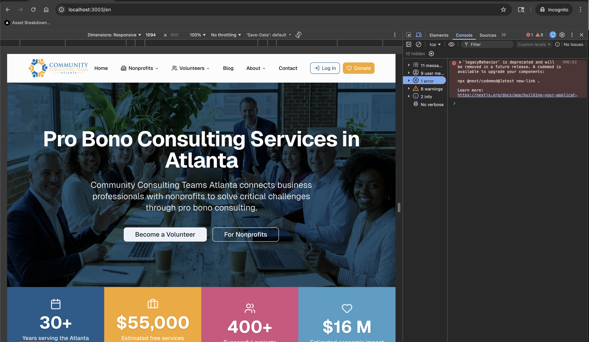

# 🔧 Troubleshooting — Common Problems & Fixes

> If something isn't working, check this page first.

---

## Installation Problems

### Node.js: "command not found" after installing

**Cause:** The terminal doesn't know where Node was installed yet.

**Fix:**
1. Close your terminal completely
2. Open a fresh terminal
3. Try `node --version` again

Still not working? Restart your computer, then try again. If it still fails, uninstall and reinstall Node.js from [nodejs.org](https://nodejs.org).

### Git: "command not found" after installing

**Same fix as Node.js above.** Close and reopen terminal. On Mac, you may need to install Xcode Command Line Tools first:
```
xcode-select --install
```

---

## Running the App

### "localhost:3000 shows nothing / connection refused"

**Possible causes:**
1. The server isn't running → Check the terminal for errors. Ask Antigravity: *"Start the dev server"*
2. Wrong port → Check the terminal output for the actual port number (might be 3001, 5173, etc.)
3. Another app is using port 3000 → Ask Antigravity: *"The port is in use. Try a different port."*

### "The page loads but shows errors or a blank screen"

Tell Antigravity: *"I see a blank page / errors in the browser. Check the terminal and browser console for errors and fix them."*

### "Changes aren't showing up when I refresh"

1. Try a hard refresh: `Ctrl+Shift+R` (Windows) or `Cmd+Shift+R` (Mac)
2. Check if the server is still running (look at the terminal)
3. Tell Antigravity: *"My changes aren't showing. Is the dev server running?"*

---

## Using the Browser Console

### What Is the Browser Console?

It's a hidden panel that shows errors and messages from your app. **This is the single best way to find out what's wrong when something breaks.**

### How to Open It

| Browser | Shortcut (Windows/Linux) | Shortcut (Mac) |
|---|---|---|
| **Chrome** | `F12` or `Ctrl + Shift + J` | `Cmd + Option + J` |
| **Edge** | `F12` or `Ctrl + Shift + J` | `Cmd + Option + J` |
| **Firefox** | `F12` or `Ctrl + Shift + K` | `Cmd + Option + K` |
| **Safari** | Enable first: Preferences > Advanced > Show Develop menu | `Cmd + Option + C` |

### What to Do When You See Errors

1. Open the console (`F12`)
2. Look for **red text** (errors)
3. **Take a screenshot** of the red errors
4. Paste the screenshot into the Antigravity chat with: *"I see these errors. Can you fix them?"*



### Common Console Messages

| What You See | What It Means |
|---|---|
| Red `Failed to fetch` | The backend server isn't running or the URL is wrong |
| Red `404 Not Found` | The page or resource doesn't exist |
| Red `CORS error` | A security setting needs adjusting |
| Yellow warnings | Something might be wrong but isn't breaking anything |
| Gray/white `HMR` messages | Normal development messages - ignore these |

---

## Antigravity Issues

### "Antigravity doesn't see my project files"

**Fix:** Make sure you opened the correct folder. Go to File → Open Folder and select your project directory.

### "Antigravity keeps making changes I didn't ask for"

**Fix:** Check that your `GEMINI.md` / `CLAUDE.md` config files are in place (`~/.gemini/`). These enforce the approval gates. If they're missing, recopy them from `starter-kit/global/`.

### "Antigravity seems confused about my project"

**Fix:** Try saying: *"Read AGENT-REFERENCE.md and docs-canonical/ to refresh your understanding of this project."*

### "The AI made a mess. How do I undo everything?"

**Option 1:** *"Undo the last change"* (reverts the most recent edit)
**Option 2:** *"Revert to the last Git commit"* (goes back to the last saved snapshot)
**Option 3:** If you haven't committed yet, it's harder — ask: *"Show me git status and help me figure out what to revert."*

---

## Chrome Extension Issues

### "The /stage command doesn't work"

**Most likely:** The Chrome extension isn't installed. See [Phase 0](../getting-started/phase-0-trust-and-setup.md#step-3-install-the-chrome-extension) for installation.

### "The extension doesn't appear in my toolbar"

1. Click the puzzle icon in Chrome's toolbar
2. Find the Antigravity extension in the list
3. Click the pin icon to keep it visible

### "I'm using Firefox / Safari / Edge, not Chrome"

The browser extension is currently available for Google Chrome only. You can still use all other Antigravity features - only `/stage` (automated browser testing) requires the extension.

---

## Deployment Issues

### "AWS account creation asks for money"

**Normal.** AWS requires a credit card to create an account, but the Free Tier is genuinely free for 12 months. Set up a billing alert (see [Phase 8](../getting-started/phase-8-deploy-to-aws.md)) to avoid surprises.

### "Amplify build failed"

Tell Antigravity: *"The Amplify build failed. Here's the error: [paste the error from the Amplify console]."* It will diagnose and fix the issue.

### "The deployed site looks different from localhost"

**Common causes:**
1. Environment variables not set in Amplify → Tell Antigravity to check
2. Build optimization changed something → Compare and fix

---

## When All Else Fails

1. **Copy the error message** and paste it to Antigravity
2. **Start a new conversation** in the same project folder
3. **Contact the person who gave you this starter kit**
4. **Check the terminal** for red text or error messages — copy and share them
